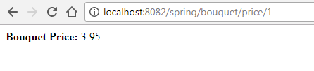
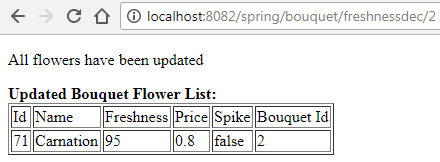
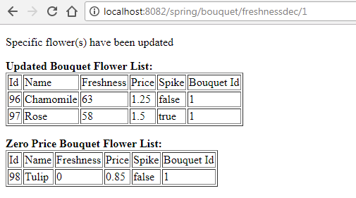
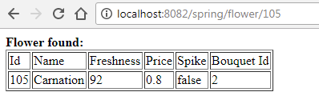
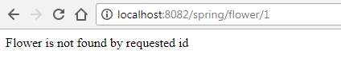
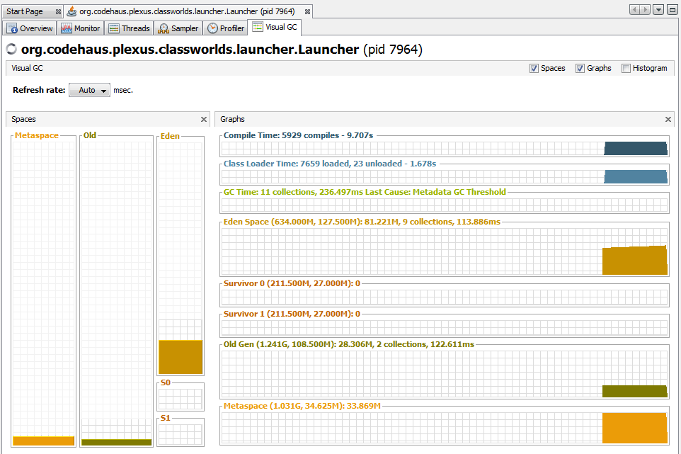

# flowergarden-web

Spring MVC application for bouquet viewing

### Steps to launch:

* `git clone https://github.com/soierr/flowergarden-web.git`    
* `cd flowergarden-web`  
* `mvn install`  
* assemble and install to local maven repo `flowergarden-1.0.jar`    
* `mvn jetty:run` make sure you have `8082` opened as the jetty server configured to establish client http connection  

Example output according to lessons 10,11 homework:

Lesson 10. Spring MVC

**Bouquet Price:**

**Freshness decrement.** Case 1: All flowers in bouquet have price >= 0 i.e. all of the is updated

**Freshness decrement.** Case 2: Only specific flowers in bouquet updated. So extra details also need to be provided

**Get flower by id.** Case 1: Flower is found

**Get flower by id.** Case 1: Flower is not found

Lesson 11. Java Memory Model

Just a snapshot of GC activity. Visual GC plugin

