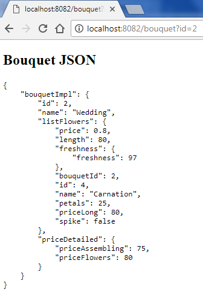

# flowergarden-web

Servlet based application for bouquet viewing

### Steps to launch:

`git clone https://github.com/soierr/flowergarden-web.git`    
`cd flowergarden-web`  
`mvn install`  
`mvn jetty:run` make sure you have `8082` opened as the jetty server configured to establish client http connection  

Example output:

